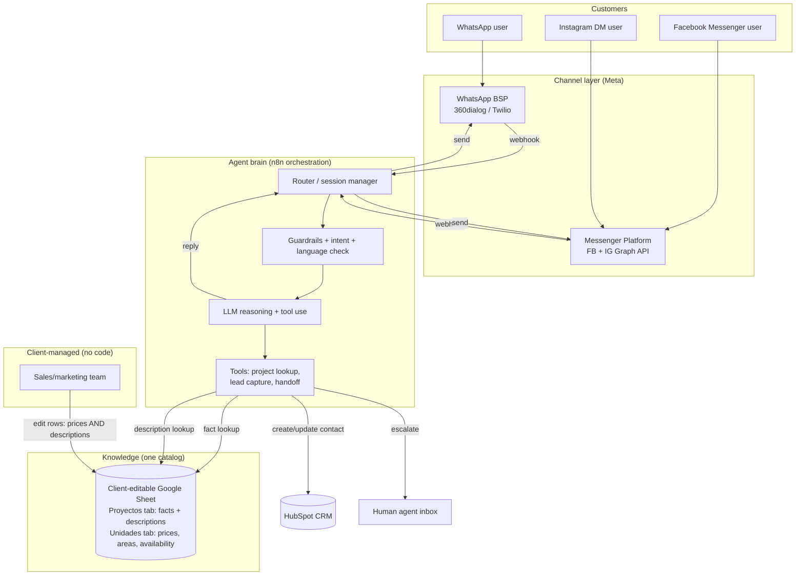

# Customer Service AI Agent — Architecture & Tooling Plan

**Client:** Real-estate construction company (D2C — sells homes directly to families)
**Goal:** An AI agent that answers WhatsApp, Facebook Messenger and Instagram DMs 24/7, answers questions about current housing projects and offerings, and captures customer details into a CRM.
**Market / language:** Spanish only — **Colombia (Ciudad Ejemplo)**, prices in COP.
**Prepared:** July 2026

---

## 1. Executive summary

The recommended solution is a **single AI agent brain behind a unified Meta messaging layer**, orchestrated with a **low-code workflow platform (n8n)**, powered by a **multilingual LLM**, writing leads into **HubSpot CRM**.

The most important design decision, given the requirement that *projects and prices change over time*, is how the knowledge is stored:

> **One client-editable catalog, two kinds of data in it.** Hard facts that change and must never be wrong — project names, house types, areas, **prices, initial payment, financing** — live in **dedicated structured columns** the client's own team edits (Google Sheets). Descriptive content — features, finishes, neighborhood, FAQs — lives in **descriptive columns in the same catalog**, editable the same way. The agent reads facts through a lookup tool and never invents a price. **Adding or removing a project is editing a row, not a code change.**
>
> *(An earlier draft split descriptions into a separate vector/RAG knowledge base. For two projects — two brochures' worth of text — that's over-engineered: a vector store, an embeddings model and an ingestion job to serve content that fits in a spreadsheet cell. Descriptions are just columns in the catalog. Revisit RAG only if the client scales to ~10+ projects with rich, distinct descriptive content — see §4.1.)*

Three supporting decisions:

- **Don't build channel plumbing from scratch.** WhatsApp, Messenger and Instagram all run on Meta's platform, but each has its own access rules, review process and 24-hour messaging window. Use a WhatsApp Business Solution Provider (BSP) and Meta's Messenger Platform so you inherit compliance and deliverability.
- **Keep the agent brain separate from the channels.** One orchestration + LLM layer serves all three channels; adding a channel later (web chat, a landing page) is a connector change, not a rebuild.
- **Two companies, shared accounts — design for it explicitly.** These are **two separate legal companies** — **Constructora Aurora** (project *Altos del Rio*) and **Constructora Bahia** (project *Villa Serena*) — but **customer service for both runs through the same WhatsApp number, Facebook page and Instagram account**. So it's **one agent and one set of Meta assets** serving both brands. The agent must (a) figure out which project a customer is asking about, and (b) tag and route each captured lead by that project to the advisors who handle it. Leads are **divided by construction project** (a company can run several projects/etapas at once), with company as a parent grouping. The catalog treats "project" and "company" as first-class fields, and the CRM segments leads by project.

For a first client project, a **low-code orchestration build (n8n)** is the sweet spot: more flexible than a closed SaaS chatbot, far faster and cheaper than a fully custom backend, and it keeps you in control of the logic and data.

> **Implementation note (build as shipped).** This document is the design plan. The channel layer that was actually built inserts **Chatwoot** (self-hosted) between the channels and n8n instead of wiring YCloud/Meta directly into n8n as §3/§5 sketch: all three channels land in one Chatwoot inbox, and n8n reacts to Chatwoot's `message_created` webhook and replies through the Chatwoot API. WhatsApp reaches Chatwoot via a small YCloud↔Chatwoot bridge (Chatwoot has no native YCloud provider); IG/Messenger are native Chatwoot channels. This adds a shared human-handoff inbox for free and keeps the "one agent brain" property intact. The knowledge model, CRM design and disambiguation logic below are unchanged. For the live architecture see [`n8n-workflows/README.md`](n8n-workflows/README.md) and [`chatwoot-deployment.md`](chatwoot-deployment.md).

---

## 2. Recommended stack at a glance

| Layer | Recommendation | Why |
|---|---|---|
| Channels | WhatsApp Business Platform + Messenger + Instagram DM | The three channels requested; all on Meta |
| WhatsApp access | BSP — **YCloud** (alt: 360dialog, Twilio) | Handles WhatsApp API access, number, templates, billing; inbound via webhook, outbound via REST |
| FB/IG access | Meta Messenger Platform (Graph API) | Native, unified Messenger + Instagram messaging |
| Orchestration | **n8n** (cloud) | Visual workflows, native LLM + HTTP nodes, full control |
| LLM (reasoning) | **Claude** or **GPT-class** model | Strong Spanish, good instruction-following, tool use |
| **Project catalog (facts + descriptions)** | **Google Sheets** | **Client-editable source of truth for prices/areas/availability *and* descriptions; has an API** |
| Knowledge base (descriptions) | Descriptive columns in the same Google Sheet | Same client-editable source; no separate vector store needed at this scale (see §4.1) |
| CRM | **HubSpot** (free tier to start) | Best free tier, excellent API, Spanish UI, native Meta integrations |
| Human handoff | Shared inbox (HubSpot / Chatwoot) | Escalate complex or high-intent conversations to a person |
| Analytics | n8n logs + CRM reports + lightweight dashboard | Track deflection, capture rate, escalations |

---

## 3. Architecture

### 3.1 Logical diagram

### 3.2 How a conversation flows

1. **Inbound.** A customer messages any channel. The BSP (WhatsApp) or Messenger Platform (FB/IG) delivers the message to an n8n webhook, which normalizes all three into one common shape (channel, sender ID, text, timestamp) so the rest of the pipeline is channel-agnostic.
2. **Session + guardrails.** n8n loads recent history for that sender, confirms Spanish, and runs light guardrails (spam, abuse, out-of-scope).
3. **Reasoning.** The LLM interprets intent (e.g. "¿cuánto cuesta la casa de 3 alcobas en Altos del Rio?") and decides whether to answer directly, look up a fact, ask a clarifying question, capture the lead, or escalate.
4. **Tools.**
   - *Project lookup* → queries the **structured catalog** for exact price, area, initial payment, availability, financing. This is why prices are always current and never hallucinated.
   - *Lead capture* → writes name, phone/WhatsApp ID, project of interest, house type, budget signals to **HubSpot**.
   - *Handoff* → flags a human on defined triggers.
   - Descriptive questions ("¿cómo son los acabados?", "¿qué hay cerca?") are answered from the **descriptive columns of the same catalog** (a per-project info lookup), not a separate knowledge base.
5. **Reply** goes back out the same channel, respecting each channel's 24-hour window rules.
6. **Persistence.** Lead + context land in HubSpot; transcripts are logged for QA.

---

## 4. Knowledge base & maintainability *(the core of this design)*

Your projects and prices change every year (both brochures literally say *"los datos y precios aquí consignados tienen una vigencia durante el presente año"*), etapas open and close, and new brands may appear. The architecture has to make **add / remove / update** trivial and safe.

### 4.1 The golden rule: facts vs. descriptions (both in one catalog)

The common mistake is letting semantic search / RAG answer *everything* — it works for "describe the house" but is dangerous for "what's the price," because retrieval can surface a stale or wrong number and the model will state it confidently. The fix is to keep the two kinds of data in **distinct columns** so a fact is always read as an exact value, never paraphrased:

- **Fact columns (source of truth).** Prices, areas, number of bedrooms, initial payment, remaining balance, delivery state (*obra gris* vs. finished), availability, accepted banks, validity year. The agent reads these through a **structured lookup tool**, so answers are always exact and current — a price is a cell, not prose.
- **Description columns.** Finishes and materials (e.g. *muros en concreto reforzado, ventanas en aluminio, cubierta en placa de concreto*), neighborhood/location, what rooms the house has, financing explanations, and a general FAQ. These change slowly and tolerate paraphrasing; the agent reads them through a **per-project info lookup**.

**Why not a vector store / RAG for the descriptions?** RAG earns its keep when the descriptive corpus is too big to fit in context, spans many documents, or changes constantly. Here it's two projects — a few hundred words of description each. That fits in a spreadsheet cell. A vector store would add an embeddings model, a vector DB, and a re-index job to serve content a `Get Project Info` lookup already returns from the same sheet — plus a semantic-search failure mode (retrieving the wrong chunk). So descriptions live as columns in the catalog. **Reconsider a vector store only when the client scales to roughly 10+ projects with rich, distinct descriptions, or wants the agent to answer from full multi-page brochures verbatim.** Until then, columns win on both simplicity and maintainability.

### 4.2 Recommended project catalog schema

A client-editable Google Sheet with **two tabs**: a `Proyectos` tab (one row per project — facts *and* descriptions) and a `Unidades` tab (one row per sellable unit type, linked by `project_id`). Modeled directly on your two brochures:

**Tab: `Proyectos`** — the last four fields are the description columns that replace a separate RAG store (§4.1)

| Field | Example — Altos del Rio | Example — Villa Serena |
|---|---|---|
| project_id | `altos-del-rio-vi` | `villa-serena-3` |
| project_name | Urbanización Altos del Rio VI | Villa Serena — Tercera Etapa |
| brand | Constructora Aurora | Constructora Bahia |
| sector | Ciudad Ejemplo — sector Altos del Rio | Ciudad Ejemplo — vía Ciudad Ejemplo–Pueblo Ejemplo |
| status | `active` | `active` |
| delivery_state | Obra gris | (to confirm) |
| financing_banks | BBVA, AV Villas, Bancolombia, FNA | BBVA, AV Villas, Bancolombia, FNA |
| price_validity_year | 2026 | 2026 |
| brochure_file | link to PDF | link to PDF |
| acabados | Muros en concreto reforzado, ventanas en aluminio, cubierta en placa… | *(from brochure)* |
| ubicacion_descripcion | Sector Altos del Rio; cercanías, vías de acceso… | Vía Ciudad Ejemplo–Pueblo Ejemplo; entorno… |
| incluye | 3 alcobas, sala-comedor, cocina, patio… | 3 habitaciones, estudio, patio… |
| faq | Preguntas frecuentes de financiación y entrega… | … |

**Tab: `Unidades`** (linked to a project by `project_id`)

| project_id | unit_name | bedrooms | area_m2 | position | price_cop | initial_30 | balance_70 | availability |
|---|---|---|---|---|---|---|---|---|
| altos-del-rio-vi | Medianera 3 alcobas | 3 | 95 | Medianera | 200,000,000 | 60,000,000 | 140,000,000 | available |
| altos-del-rio-vi | Medianera 2 alcobas | 2 | 48 | Medianera | 160,000,000 | 48,000,000 | 112,000,000 | available |
| altos-del-rio-vi | Esquinera Tipo A | 3 | 96 | Esquinera | *(to confirm)* | | | available |
| villa-serena-3 | Casa 77 m² 3 hab | 3 | 77 | — | *(price to confirm)* | | | available |

> **Live sheet naming.** The tables above use English placeholders for clarity. The catalog as built names the unit tab **`Tipos de Unidad`** with Spanish headers (`tipo_unidad, alcobas, area_m2, posicion, precio_cop, cuota_inicial_30, saldo_70, disponibilidad`) and adds a third **`Conversaciones`** transcript tab. See `n8n-workflows/README.md §4.2` for the exact columns the tools read.

> Note from the brochures: the *Altos del Rio* price sheet lists only the two *medianera* rows in obra gris; the *Villa Serena* brochure shows the house (77.31 m², 3 habitaciones, estudio, patio) but **no price table**. Those gaps are exactly what the catalog surfaces — the agent should say "te confirmo el precio con un asesor" and capture the lead when a value is missing, rather than guess.

### 4.3 Adding / removing / updating a project — the operational workflow

- **Update a price:** the sales team edits the cell in the `Unidades` tab. The agent picks it up on the next lookup — no deploy, no developer.
- **Update a description** (finishes, FAQ, location): edit the description column on the `Proyectos` tab. Live on the next lookup — no re-index, no ingestion job, because there's no vector store to sync.
- **Add a project or etapa:** add the project row on `Proyectos` (facts + descriptions) and its unit rows on `Unidades`. The new project is live immediately. Optionally drop the brochure PDF link in `brochure_file` for reference.
- **Close a project (sold out / etapa ended):** set `status = inactive` (or unit `availability = sold`). The agent immediately stops offering it and can respond "ese proyecto ya está vendido, pero tenemos…".
- **Yearly price refresh:** bump `price_validity_year` and update values in one place.

This keeps a non-technical team fully in control of what the bot says about offerings, which is the maintainability requirement.

### 4.4 Handling brochure content (PDFs, renders, plans)

Your source material is image-heavy PDFs (renders, architectural plans, location maps). Two practical points: (1) the **text, price tables and descriptions** should be transcribed into the catalog — into the fact and description columns respectively — so nothing depends on OCR of an image at answer time; (2) the **renders and plan images** can be stored and sent to customers ("¿me mandas fotos?") by keeping image URLs in the catalog row, so the agent can share the right render for the right project. This is a one-time transcription per project (or per etapa), done by hand into the sheet — no automated ingestion pipeline, because there's no vector store to feed.

### 4.5 Two companies through one account — disambiguation & lead routing

Because a single WhatsApp/FB/IG account serves both **Aurora** and **Bahia**, the agent has to keep the two straight and hand each lead to the right company. This is handled entirely in the agent logic and CRM — no extra channels needed:

- **Disambiguate early.** When a customer's intent maps to a specific project, the project row tells the agent both the `project` and its parent `company`. When the opening message is generic ("¿qué casas tienen disponibles?"), the agent presents the active projects and lets the customer pick — then scopes the rest of the conversation to that project so it never mixes a Altos del Rio price with a Villa Serena house.
- **Divide leads by construction project, within company.** The real segmentation the sales side needs is **per project** — a company can run several projects/etapas at once (e.g. new Altos del Rio and Villa Serena etapas). So the lead-capture tool writes **both** a `company` and a `project` field to HubSpot on every contact and deal, with `project` as the primary division and `company` as the parent grouping.
- **Segment with catalog-driven properties, not one pipeline per project.** Projects and etapas open and close, so fixed pipelines per project would proliferate and go stale. Instead use a **`project` property (its values come straight from the catalog) plus saved views/lists per project**, and assignment/routing rules that send each project's leads to the advisors who handle that project. Adding a project = a new catalog row and a new property value, not a CRM rebuild.
- **Keep messaging neutral at the top.** Because one number represents both companies and all projects, the greeting stays neutral ("¡Hola! Tenemos proyectos de vivienda en Ciudad Ejemplo…") until the customer's interest is known, then switches to the specific project's name and details.

This gives you the operational simplicity of one shared account with clean separation where it matters: the data, the pricing, and — divided by project — who follows up.

---

## 5. Channel layer — the important details

All three channels are Meta products, but they are **not interchangeable**.

**WhatsApp Business Platform.** Access is via the Cloud API through a **BSP** — this build uses **YCloud** (360dialog, Twilio and other Meta partners are equivalent alternatives) — that provisions the business number, manages template approvals and billing. YCloud delivers inbound messages to an n8n webhook (`whatsapp.inbound_message.received`) and sends outbound via its REST API (`/v2/whatsapp/messages`). Billing is **per-message** for business-initiated templates. Crucially for support: **when a customer messages first, a 24-hour service window opens and every reply inside it is free** — and a support agent is almost always replying to inbound messages, so most conversations are free. **Colombia is one of the cheapest WhatsApp markets in the world** (utility/authentication messages ~US$0.0008 each; marketing higher but still low), and as of April 2026 you can be billed directly in **COP**. Proactive re-engagement after 24h needs a pre-approved template and is billed per message.

**Facebook Messenger & Instagram DM.** Both run on Meta's **Messenger Platform / Graph API** and share the same **24-hour window**. Instagram messaging requires an **Instagram Business/Creator account** and the `instagram_business_manage_messages` permission via **Meta App Review** (can take weeks — start early). Facebook Page messaging needs `pages_messaging`. You can develop/demo against ~25 test users before review.

**Practical implication:** budget calendar time for **Meta App Review, WhatsApp number verification, and Business Manager setup** — these are the usual launch-delaying items, not the code. Since both companies share **one** WhatsApp number, Facebook page and Instagram account, you only set up and verify **one** set of Meta assets — simpler operationally. The trade-off moves into the conversation: with one number fielding questions about both companies, the agent must disambiguate brand/project up front (see Section 4.5).

---

## 6. The agent brain

**Orchestration — n8n.** Visual workflows, native nodes for LLMs, HTTP/webhooks, Google Sheets and HubSpot, plus custom-code escape hatches. Self-hostable, so lead data stays under your control.

**LLM.** A strong multilingual model (Claude or GPT-class) — both handle Colombian Spanish naturally and support tool calling, which is what lets the agent look up the catalog and write to the CRM. Keep it behind the orchestration layer so you can swap models freely.

**Grounding.** Both facts and descriptions come from the one client-editable catalog (Section 4) — facts from the structured columns, descriptions from the description columns. Core instruction: **never state a price or figure that isn't in the catalog — if it's missing, capture the lead and hand to an advisor.**

**Human handoff.** Define escalation triggers — ready-to-buy intent, financing/credit questions needing an advisor, a missing price, complaints, repeated confusion, or explicit "quiero hablar con alguien" — routing to a shared human inbox (HubSpot or Chatwoot). This protects CX and captures the highest-value leads.

---

## 7. CRM recommendation — HubSpot

**Start on HubSpot's free tier; upgrade only when volume justifies it.**

- **Best free tier** — unlimited contacts and a usable pipeline, near-zero starting cost.
- **Excellent API** — simple for n8n to create/update contacts and deals, which is the core requirement ("save customer details in a CRM").
- **Full Spanish UI** and native Meta/WhatsApp integrations, so the sales team works in their own language.
- **Room to grow** into follow-up sequences and reporting.

**Value alternative: Zoho CRM** (cheapest paid tiers, solid API). **Pipedrive** is great for pure sales pipelines but has no free tier. **Salesforce** is overkill for this SMB.

**Capture per lead:** name, phone/WhatsApp ID, channel/source, **construction project of interest (primary) + company (Aurora vs. Bahia)**, house type, bedrooms wanted, budget/financing signals (which bank, needs credit?), and the transcript link. Map these to HubSpot properties up front so reporting is clean from day one.

**Segment by construction project.** Leads must be divided **by project**, not only by company — a company may run several projects/etapas at once. Rather than a pipeline per project (which would multiply and go stale as etapas open and close), use a **`project` property whose values come from the catalog**, plus **per-project saved views/lists and assignment rules** that route each project's leads to the advisors who handle it. `company` stays as a parent grouping for company-level reporting. Adding or retiring a project is a property/catalog change, not a CRM restructure. HubSpot's free tier supports this.

---

## 8. Indicative costs (monthly, early stage)

| Item | Estimate | Notes |
|---|---|---|
| WhatsApp messaging | Very low | Most replies fall in the free 24h window; Colombia is among the cheapest markets, billable in COP |
| BSP fee | ~US$0–50 | Some BSPs charge a platform fee; some are pay-per-message only |
| FB / IG messaging | US$0 | No per-message fee on Messenger Platform |
| LLM usage | Usage-based | Scales with conversation volume; cents per conversation with a mid-tier model |
| Vector store | US$0 | Not used — descriptions live in the Google Sheet catalog (see §4.1) |
| Google Sheets | US$0 | Free; the single client-editable catalog for facts and descriptions |
| n8n | US$0–50 | Free self-hosted, or low-cost cloud |
| HubSpot | US$0 to start | Free tier |
| **Rough total** | **Low tens of dollars to start** | Dominated by LLM + proactive (template) messaging as you scale |

Cost is driven by **conversation volume** and **proactive template messaging**, not fixed platform fees — good for starting small.

---

## 9. Phased rollout

**Phase 1 — Foundation & prototype (weeks 1–3).** Build the **project catalog** from the two brochures (transcribe both the price tables and the descriptions into the sheet), stand up n8n + LLM, build the WhatsApp flow first, and demo against Meta test users. Kick off **Meta App Review, WhatsApp verification and Business Manager** in week 1.

**Phase 2 — Full channel + CRM (weeks 3–6).** Add Messenger and Instagram once review clears, wire HubSpot lead capture, define escalation rules and the human inbox, and test in Colombian Spanish with real questions ("¿aceptan crédito con FNA?", "¿la entregan en obra gris?").

**Phase 3 — Launch & harden (weeks 6–8).** Soft-launch on WhatsApp, monitor transcripts daily, tune the catalog and prompts from real conversations, then open the other channels.

**Phase 4 — Optimize (ongoing).** Track deflection, lead-capture and escalation rates; add proactive template flows (e.g. re-engaging quote requests, new-etapa announcements) once the reactive bot is solid.

---

## 10. Key risks & how to manage them

- **Meta App Review delays** — the #1 launch risk. Start review + verification on day one; build against test users meanwhile.
- **Hallucinated prices** — mitigated by keeping prices in the structured catalog only, an explicit "never invent a figure" instruction, and lead-capture on any missing value.
- **Stale offerings** — the catalog's `status`/`availability`/`price_validity_year` fields plus an easy edit workflow keep the bot current; assign an owner for updates.
- **24-hour window rules** — design flows around them; use approved templates and opt-in for any outbound re-engagement.
- **Data privacy (Colombia) — two companies, one capture point.** Capturing name + phone triggers **Ley 1581 de 2012 (Habeas Data)**, supervised by the **SIC**. Because two separate legal entities collect data through the same channel, clarify the *autorización de tratamiento de datos*: either each company is the data controller for its own leads, or one entity collects and shares with the other under a documented arrangement. The consent message should name both companies (or the shared brand) and link a privacy notice. Keep lead data in systems you control.
- **Multi-brand confusion** — the `brand`/`company` field, early disambiguation (Section 4.5) and a single shared CRM pipeline segmented by `company`/`project` properties (see `hubspot-crm-setup-guide.md`) stop the agent from mixing Aurora and Bahia offers or sending a lead to the wrong team. If hard record-level separation between companies is ever needed, that's solved with HubSpot Teams/permissions, not separate pipelines.
- **Dead-end frustration** — always offer a human path; measure escalation quality, not just deflection.

---

## 11. Open questions for the client

1. **Lead routing by project.** Confirmed: two companies (Aurora, Bahia) sharing one account, with leads divided **by construction project**. Which advisor(s) handle each project, and who is the escalation contact per project? (This drives the per-project assignment rules.)
2. **Data-controller setup for privacy.** With two legal entities collecting leads through one channel, how should the *autorización de tratamiento de datos* be worded — one shared notice, or each company as controller of its own leads?
3. **Villa Serena pricing** — the brochure has no price table. What are the prices/units, and should the agent quote them or route to an advisor?
4. **How is the catalog maintained today?** Who will own updating prices/availability and descriptions — and are they comfortable editing a Google Sheet?
5. **Existing Meta assets** — is the shared Facebook Business Manager / WhatsApp number / Instagram Business account already verified, or does it need setup?
6. **Expected message volume** (per day/month) — drives cost and self-host vs. managed choices.
7. **What defines a hot lead** worth escalating to a human immediately (e.g. asks about credit, ready to pay cuota inicial)?
8. **Should the agent share renders/plans** from the brochures, and can we get the source images?

---

*This document covers architecture, tooling and the maintainable knowledge model. Suggested next deliverables: (a) the actual project-catalog template pre-filled from these two brochures, (b) a detailed conversation-flow design in Spanish, or (c) a Phase 1 build backlog.*
